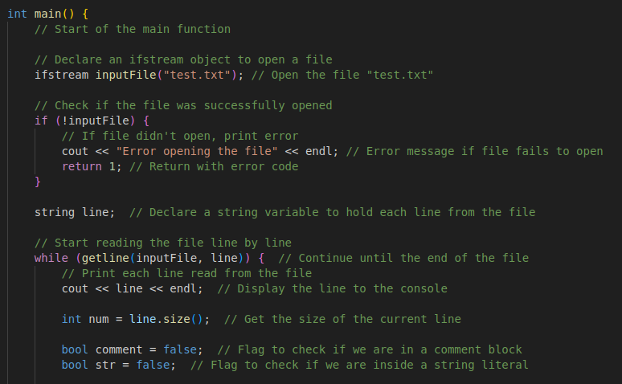
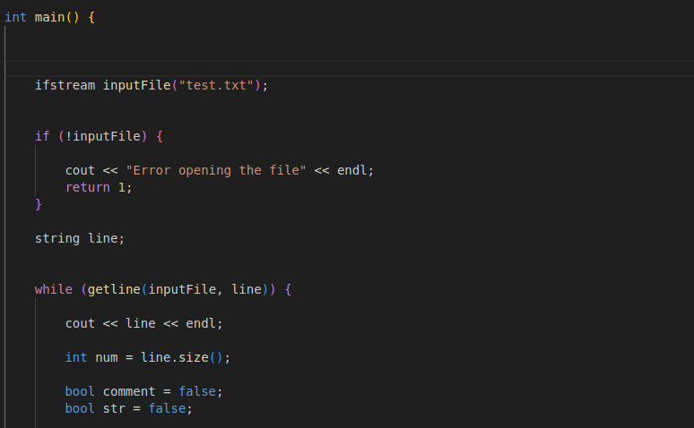

<h1>The c++ Comment remover code</h1>

This is the code which remove the comment form the c++ programm only add the file to it after it it remove all the comment form the programme every type of comment it work in every type of comment 

The code before removing the comment
  
  

The code after removing the comment 
  
  